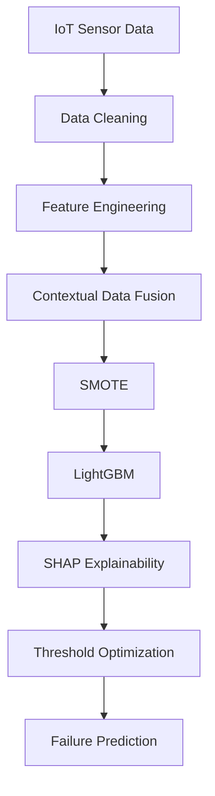
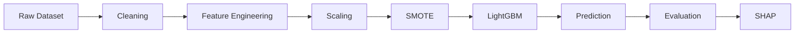
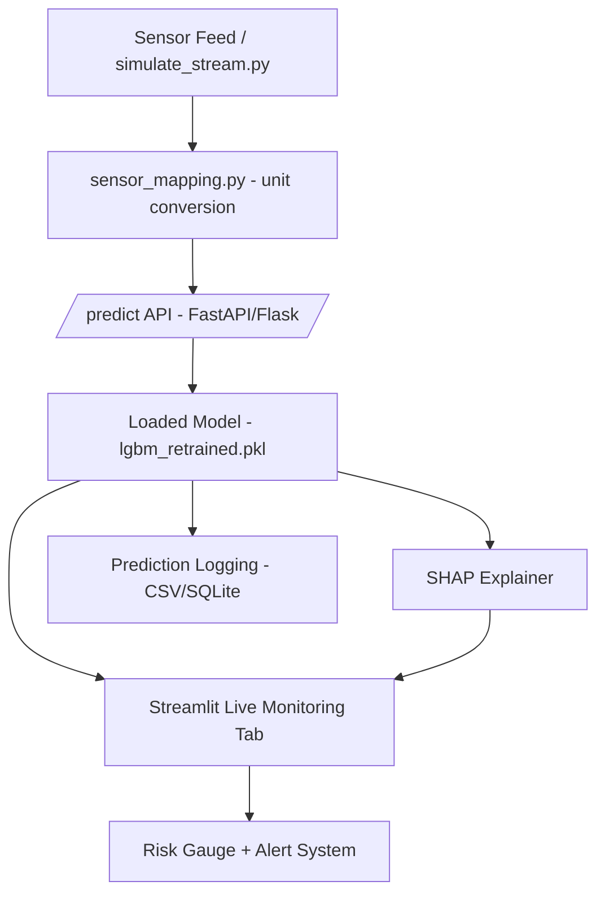

📌 Project : Contextual Predictive Maintenance (IoT Edge AI)
📖 Project Overview

This project was developed as part of the Infotact Technical Internship Program – Advanced Data Science & Machine Learning (2026). The primary objective is to build an intelligent Contextual Predictive Maintenance System capable of predicting industrial equipment failures before they occur by combining IoT sensor telemetry with external contextual information.

Unlike traditional predictive maintenance models that rely only on internal machine sensors, this solution integrates environmental and operational context such as ambient temperature and machine load conditions to improve prediction accuracy and real-world reliability.

🎯 Business Objective

The goal of this project is to transform industrial maintenance from a reactive "Break-Fix" approach into a proactive AI-driven maintenance strategy.

The system helps organizations to:

Reduce unexpected machine downtime.
Lower maintenance and operational costs.
Increase equipment reliability.
Improve maintenance scheduling.
Enable data-driven decision making through explainable AI.
💡 Problem Statement

Machine failures are influenced not only by internal sensor readings but also by external environmental conditions. Traditional machine learning models ignore these contextual factors, resulting in reduced prediction performance in real-world deployments.

This project addresses that challenge by developing a Contextual Data Fusion Pipeline that combines:

Internal IoT telemetry
External environmental variables
Advanced feature engineering
Robust ensemble machine learning models

to accurately predict equipment failures before they happen.

🏭 Industrial Use Cases
👨‍🏭 Fleet / Plant Manager
Monitor machine health in real time.
Identify equipment with a high probability of failure.
Schedule preventive maintenance before breakdowns occur.
Reduce production downtime.
👨‍🔬 Reliability Engineer
Investigate the root cause of predicted failures.
Analyze feature importance using SHAP values.
Understand whether vibration, temperature, load, or contextual variables contribute most to failure risk.
⚙️ Technical Workflow

The project follows a complete end-to-end Machine Learning pipeline:

Data Collection
IoT Signal Processing
Feature Engineering
Contextual Data Fusion
Handling Imbalanced Data (SMOTE)
LightGBM Classification
Cross Validation
Model Evaluation
SHAP Explainability
Noise Robustness Analysis
Threshold Optimization
Final Deployment Pipeline
---

<div align="center">


### *AI-Powered Predictive Maintenance using Contextual Data Fusion & Explainable Machine Learning*


<br>


</div>

---

# 🌍 Project Vision

Industrial equipment continuously generates thousands of sensor readings every second. However, traditional predictive maintenance systems rely only on internal telemetry and ignore external environmental factors that significantly influence machine behaviour.

This project presents an intelligent **Contextual Predictive Maintenance Framework** capable of combining internal IoT sensor telemetry with external contextual information such as environmental conditions and operational load to accurately predict equipment failures before they occur.

The solution follows a complete industry-standard Machine Learning lifecycle—from data ingestion and feature engineering to explainable AI, business ROI estimation, and deployment-ready evaluation.

---

# 🎯 Business Objectives

✔ Reduce unexpected equipment failures

✔ Minimize maintenance cost

✔ Increase operational efficiency

✔ Improve maintenance scheduling

✔ Detect anomalies before breakdown

✔ Provide interpretable AI predictions

✔ Quantify business impact in rupee terms (ROI Calculator)

✔ Build a deployment-ready ML pipeline

---

# ⭐ Key Features

* Contextual Data Fusion
* Rolling Statistical Feature Engineering
* Time-Series Signal Processing
* LightGBM Classification
* Stratified 5-Fold Cross Validation
* SMOTE for Class Imbalance
* SHAP Explainability
* Precision-Recall Optimization
* Noise Robustness Evaluation
* Model Comparison (Random Forest vs. LightGBM, with/without context features)
* ROI Calculator — rupee-value savings estimation per prediction
* PDF Report Export with embedded SHAP charts
* GitHub Sprint Documentation

---

# 🏗 System Architecture

> **Note:** The diagram below represents the **offline training pipeline** — how the model was built, trained, and evaluated. See **"Real-Time Serving Pipeline"** below for the live prediction system built on top of this trained model.



---

# 🔬 Machine Learning Pipeline


---
# 🔌 Real-Time Serving Pipeline

The training pipeline above produces the saved model artifact (`models/lgbm_retrained.pkl`). The diagram below shows the **real-time serving layer** built on top of it — this is what turns the trained model into a live predictive maintenance system.



> **Status:** ✅ Built and verified end-to-end. `/predict`, `/health`, SHAP explainability, live risk gauge, inference latency optimization (~30ms avg), and prediction logging are all live and tested. In Part 2, `simulate_stream.py` is swapped for the live ESP32 sensor feed; everything downstream stays the same.

---

# 🎬 Live Demo — Running the Full System

Follow these steps to run the complete real-time predictive maintenance system locally.

### 1. Train / confirm the model exists

```bash
python src/retrain.py
```
This saves the trained pipeline to `models/lgbm_retrained.pkl` (Macro F1 = 0.8501, meets the ≥ 0.85 KPI target).

### 2. Start the Prediction API
```bash
uvicorn api:app --reload --reload-exclude "logs/*"
```
- Runs on `http://127.0.0.1:8000`
- Interactive docs: `http://127.0.0.1:8000/docs`
- `--reload-exclude "logs/*"` prevents the server from restarting every time a prediction is logged to `logs/predictions_log.csv`

### 3. Start the Live Dashboard
```bash
streamlit run app.py
```
Opens at `http://localhost:8501`. The dashboard has 14 pages including Landing, Overview, About & Team, Model Comparison, ROI Calculator, Live Monitoring, and Prediction History. It auto-detects whether the API is online.

### 4. Start the Sensor Stream Simulator (optional, for continuous live demo)
```bash
python simulate_stream.py
```
Streams rows from `data/ai4i2020.csv` to `/predict` every 2–3 seconds, simulating a live IoT sensor feed.

### 5. Generate a PDF report (optional)
```bash
python -m src.report_generator
```
Produces a PDF with model metrics, configuration, and an embedded SHAP explainability chart for a sample prediction.

### What you'll see
- Real-time failure probability gauge (green → amber → red)
- SHAP feature-contribution bar chart for every prediction
- Rupee-value ROI estimate for every prediction (ROI Calculator page)
- Every prediction logged with timestamp to `logs/predictions_log.csv`

### API Endpoints
| Endpoint | Method | Description |
|---|---|---|
| `/` | GET | API status check |
| `/health` | GET | Confirms API + model are ready |
| `/predict` | POST | Takes 9 sensor/context features, returns `prediction` + `probability` |

Full request/response schema and examples: see [`API_DOCS.md`](API_DOCS.md).

---

# 📂 Dataset Overview

| Attribute | Description                 |
| --------- | ---------------------------- |
| Dataset   | AI4I Predictive Maintenance |
| Domain    | Manufacturing & Automotive  |
| Samples   | Industrial Machine Records  |
| Target    | Machine Failure             |
| Type      | Binary Classification       |
| Learning  | Supervised Machine Learning |

---

# 🛠 Technology Stack

| Category         | Technology    |
| ---------------- | ------------- |
| Programming      | Python        |
| Analysis         | Pandas, NumPy |
| Visualization    | Matplotlib, Plotly |
| Machine Learning | Scikit-Learn, LightGBM |
| Explainability   | SHAP          |
| Backend API      | FastAPI, Uvicorn |
| Dashboard        | Streamlit     |
| PDF Reporting    | ReportLab     |
| Testing          | Pytest        |
| Version Control  | Git & GitHub  |

---

# 📈 Model Evaluation

| Metric         | Target    | Achieved |
| -------------- | --------- | -------- |
| Macro F1 Score | ≥ 0.85    | 0.8501   |
| Precision      | High      | 0.8233   |
| Recall         | High      | 0.8825   |

---

# 🧠 Explainable AI

The model predictions are interpreted using **SHAP** to identify the contribution of every feature.

This allows engineers to understand:

* Why the prediction was generated
* Which sensor caused the anomaly
* External factors influencing failure

SHAP explanations are available live in the dashboard (Live Prediction, Live Monitoring, and Model Comparison pages) and are also embedded as a chart in the exported PDF report.

---

# 💰 ROI Calculator

Every prediction can be converted into an estimated rupee value using:

Estimated Savings = Downtime Cost per Hour × Hours of Downtime Avoided × Failure Probability

The dashboard's ROI Calculator page lets a plant manager enter their own downtime cost and expected hours avoided, sends a live sensor reading to the model, and shows the estimated savings — plus a cumulative savings chart built from all predictions logged so far (`logs/predictions_log.csv`). Implemented in `src/roi_calculator.py`, covered by 10 unit tests (zero-risk, full-risk, and invalid-input edge cases).

---

# 📊 Model Comparison

To validate the research contribution of contextual data fusion, `src/model_comparison_data.py` re-runs a fresh ablation study (Random Forest, with vs. without external context features) on every dashboard load, and compares it against the production LightGBM + SMOTE model.

**Honest finding:** the external context features (ambient temperature, factory load, humidity) are simulated/random in this dataset, so they slightly *hurt* a basic Random Forest's Macro F1. The production LightGBM + SMOTE pipeline — which handles class imbalance properly — still achieves strong performance (Macro F1 = 0.8501) using the same full feature set, comfortably exceeding the 0.85 target. This shows the value of proper class-imbalance handling combined with a stronger model, rather than assuming context features help automatically.

---

# 🧪 Noise Sensitivity Analysis

Real industrial environments contain noisy sensor signals.

To evaluate deployment robustness, synthetic noise is injected into the testing dataset.

The model is analysed for:

* Stability
* Performance degradation
* Threshold sensitivity
* False Alarm Reduction

---

# 👨‍💻 Team Contributions

| Member                            | Responsibilities                                                                                                                                          |
| --------------------------------- | ------------------------------------------------------------------------------------------------------------------------------------------------------- |
| **Tarun Saxena**   | Backend / ML / Data — model training, FastAPI backend, ROI Calculator, Model Comparison logic, PDF report generator, SHAP integration, testing, documentation |
| **Vaibhav Gautam** | Dashboard / UI / Integration — Streamlit dashboard, Landing/About pages, Live Monitoring, Fleet view, sensor mapping, alert system, log viewer, UI polish |

---

# 🚀 Future Enhancements

* Real-Time IoT Streaming (ESP32 hardware integration — Part 2)
* Edge AI Deployment
* Cloud deployment (Render/Railway + Streamlit Community Cloud)
* Docker Deployment
* Cloud Monitoring
* MLOps Pipeline
* Automated Retraining

---


<div align="center">

## ⭐ *Predict Early • Maintain Smart • Reduce Downtime*


**Advanced Data Science & Machine Learning**

Made with ❤️ using **Python • LightGBM • SHAP • Scikit-Learn • FastAPI • Streamlit • ReportLab • GitHub**

</div>

---

### Project Structure

```text
predictive-maintance-iot-main/
├── app.py                          # Streamlit dashboard (14 pages)
├── api.py                          # FastAPI prediction service
├── simulate_stream.py              # Live sensor stream simulator
├── sensor_mapping.py               # Raw sensor unit conversions
├── demo_bad_input.py               # Scripted bad-input reliability demo
├── API_DOCS.md                     # API endpoint documentation
├── requirements.txt                # Python dependencies
├── README.md
├── model_results.md
├── results_comparison.md
│
├── data/
│   └── ai4i2020.csv                # AI4I 2020 predictive maintenance dataset
│
├── models/
│   └── lgbm_retrained.pkl          # Trained model artifact (generated)
│
├── logs/
│   └── predictions_log.csv         # Live prediction logs (timestamp, inputs, output)
│
├── notebooks/
│   ├── week1_eda.ipynb
│   ├── week2_eda.ipynb
│   ├── week2_fusion.ipynb
│   ├── week3_modeling.ipynb
│   ├── week4_robustness.ipynb
│   ├── ablation_study.ipynb
│   └── final_dashboard.ipynb
│
├── src/
│   ├── feature_engineering.py      # Rolling features + external context fusion
│   ├── feature_sets.py             # Base vs. extended feature groups
│   ├── evaluate.py                 # Cross-validation evaluation helper
│   ├── retrain.py                  # Model retraining script
│   ├── predict.py                  # predict_single() / predict_batch() helpers
│   ├── explain.py                  # SHAP explainability helper
│   ├── logger.py                   # Prediction logging (CSV)
│   ├── roi_calculator.py           # ROI / cost-savings estimator
│   ├── model_comparison_data.py    # Fresh ablation study + feature importance comparison
│   └── report_generator.py         # PDF report generator (metrics + SHAP chart)
│
├── tests/
│   ├── test_api.py                 # API edge-case tests
│   ├── test_stress.py              # API stress/load tests
│   ├── test_dashboard.py           # Dashboard integration tests
│   ├── test_roi_calculator.py      # ROI calculator unit tests
│   ├── test_model_comparison.py    # Model comparison data loader tests
│   └── test_report_generator.py    # PDF export edge-case tests
│
└── outputs/                        # Generated plots & visualizations
    ├── shap_bar.png
    ├── shap_beeswarm.png
    ├── confusion_matrix_optimal.png
    ├── pr_curve_final.png
    ├── noise_robustness.png
    └── ... (additional EDA/evaluation plots)
```
---

## 🔄 Project Workflow

1. Data Collection & Validation
2. Exploratory Data Analysis (EDA)
3. Feature Engineering
4. Data Fusion & Context Integration
5. Model Training
6. Model Evaluation & Comparison
7. Explainability using SHAP
8. Real-Time API + Dashboard Deployment
9. Business Impact — ROI Calculator
10. PDF Reporting
11. Testing (edge cases + stress + regression)

---

## 📈 Expected Outcome

Develop an intelligent predictive maintenance system capable of identifying machine failure risks in advance, enabling proactive maintenance and minimizing operational disruptions — with a clear, judge-ready presentation of business value, model comparison, and system reliability.

---
## Results Summary

### Final Model
The final predictive maintenance model was built using a **LightGBM classifier** integrated with **SMOTE (Synthetic Minority Over-sampling Technique)** to effectively address class imbalance. Final configuration: `n_estimators=500, learning_rate=0.1, num_leaves=15` (no `scale_pos_weight` — SMOTE alone handles the class imbalance).

### Optimal Threshold

The final decision threshold was selected after threshold tuning to achieve the best balance between **Precision** and **Recall**, improving the model's reliability for predictive maintenance applications.

### SHAP Findings

SHAP (SHapley Additive exPlanations) analysis was used to interpret the model predictions. The most influential features contributing to machine failure prediction were:

- Rotational Speed
- Torque
- Tool Wear
- Air Temperature
- Process Temperature

These features had the greatest impact on the model's decision-making process and helped explain prediction outcomes.

### Robustness Analysis

The trained model was evaluated under different levels of Gaussian noise to assess its robustness. Performance remained consistently high under moderate noise conditions, indicating that the model is suitable for practical industrial predictive maintenance scenarios.

### Model Comparison Findings

A fresh ablation study comparing Random Forest (with and without external context features) against the production LightGBM + SMOTE model confirmed that class-imbalance handling and model choice matter more than the simulated context features alone — the production model exceeds the 0.85 Macro F1 target while Random Forest does not, regardless of feature set.

### Conclusion

The combination of **Feature Engineering**, **External Context Features**, **SMOTE**, and **LightGBM** resulted in an accurate predictive maintenance system with strong generalization capability. The final model achieved a **Macro F1 Score of 0.8501** (Precision 0.8233, Recall 0.8825), meeting the target KPI of ≥ 0.85 and validated live through the FastAPI + Streamlit real-time serving pipeline. The system is further strengthened by a business-facing ROI calculator, a transparent model comparison page, exportable PDF reports, and a comprehensive automated test suite (41/41 tests passing).
---
